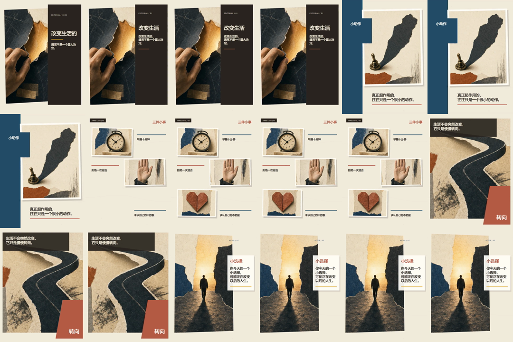
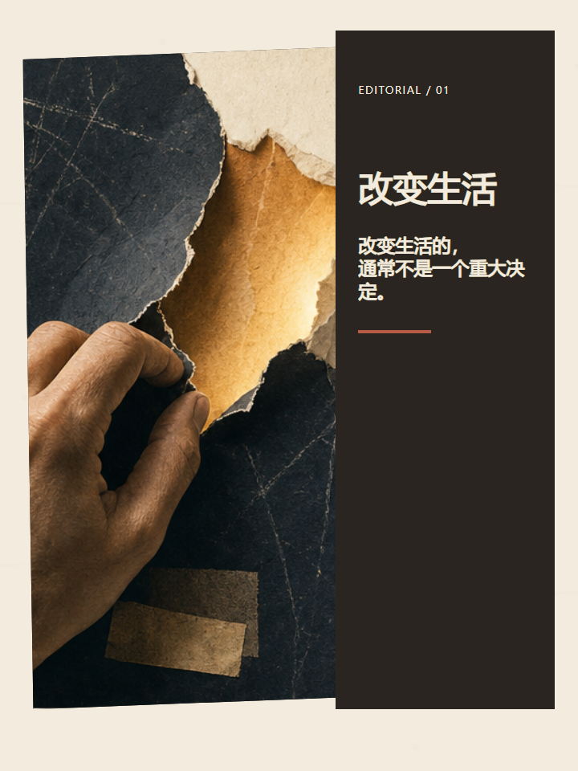
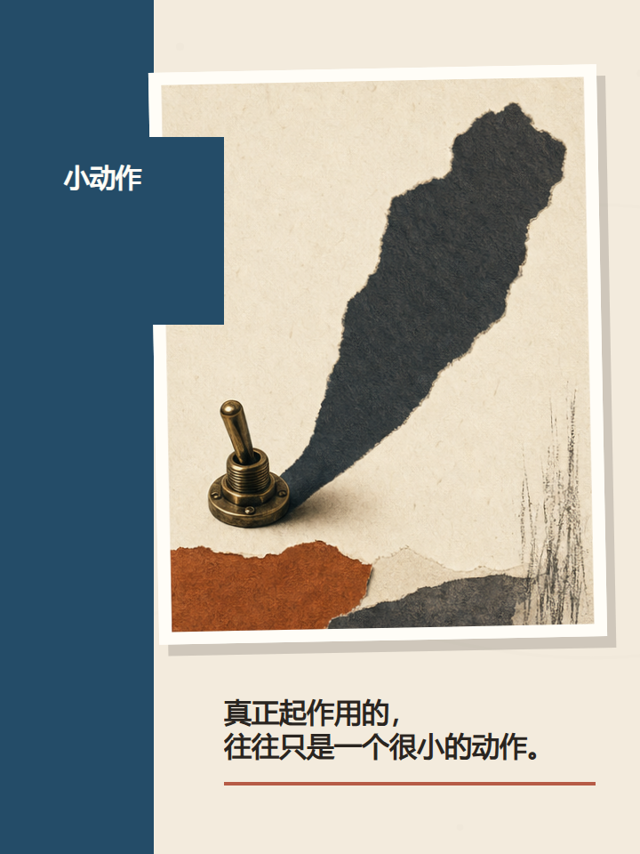
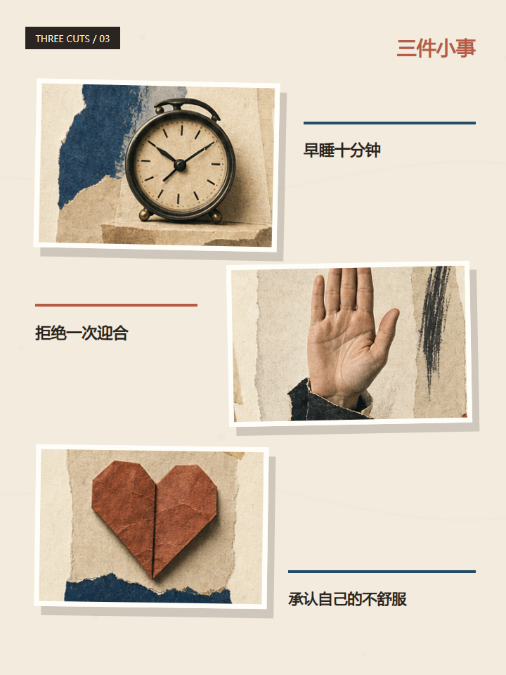
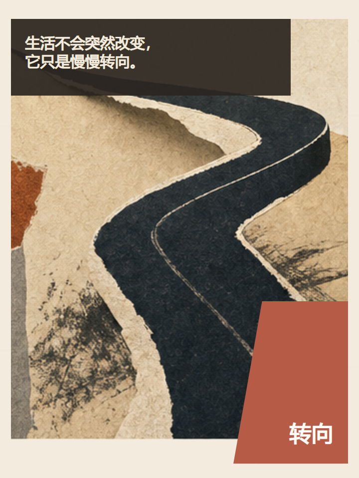
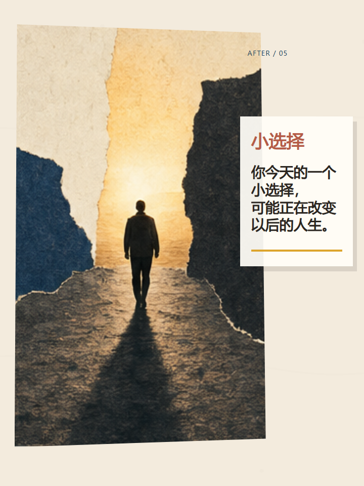

# Direction A Static Frame Review

## Result

`CANDIDATE READY — USER VISUAL APPROVAL PENDING`

Direction A itself is approved. These frames are the real Remotion Composition
candidate for template approval; a machine PASS is not treated as visual
approval.

## Preview

[18-second Direction A Remotion preview](direction-a-validation/direction-a-remotion-preview.mp4)

| Layout | Evidence |
|---|---|
| Split column |  |
| Scale contrast |  |
| Staggered notes |  |
| Full-bleed turn |  |
| Quiet asymmetry |  |

## Visual review

- `split-column`: the torn-paper hand now fills the image column; the approved
  `改变生活` keyword and source sentence share the same editorial panel.
- `scale-contrast`: the switch and its oversized shadow fill the white card;
  the keyword is the source-faithful `小动作`.
- `staggered-notes`: clock, stop hand and folded heart each fill a distinct
  card; the three source actions appear once each, with no duplicated subtitle.
- `full-bleed-turn`: the bending road occupies the main canvas and the
  `转向` keyword is integrated into the rust paper block.
- `quiet-asymmetry`: the walker/light artwork is enlarged and lifted; a paper
  text panel preserves contrast while the image remains dominant.
- One-second contact-sheet review shows five materially different layouts and
  no obvious adjacent-template repetition across the 18-second preview.

## Machine checks

- five unique layouts: PASS;
- no adjacent layout repeat across the five validation segments: PASS;
- left, right, distributed/center and full visual positions: PASS;
- one explicit detail/close-up layout: PASS;
- caption height at most 22%: PASS;
- caption maximum two lines: PASS;
- transition families at most two: PASS;
- all five PNGs are non-empty, opaque 720×960 frames: PASS;
- Preview and Final media-contract/QC checks: PASS;
- public release: false; Rights Hold remains active.

## Review limitation

The Composition uses the approved text-free Direction A art atlas, not the old
geometric scene fixture. The copy and keywords are rendered live with the
licensed local Chinese font; they are not baked into the artwork.

This is still synthetic validation content, not a real book. The evidence is
ready for user visual review, but the recorded status remains
`REMOTION_TEMPLATE_VISUAL_VALIDATION_PENDING_USER_REVIEW`; Phase 4C is not
authorized by this report.
