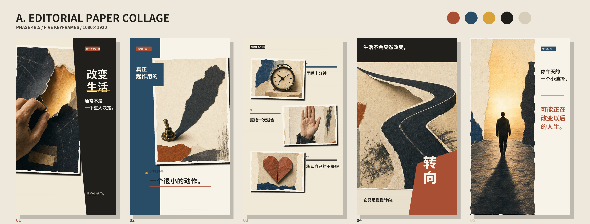

# Direction A — Editorial Paper Collage

## Visual identity

Mature magazine collage using torn photography, editorial blocks, strong keyword typography, asymmetric paper layers and rust/cobalt accents. The five frames deliberately move between split-screen, scale contrast, three-item layout, full-frame directional image and quiet asymmetric ending.

## Frame decisions

1. A hand tears a dark paper layer to expose warm light; the copy sits in an offset black editorial column.
2. A tiny brass switch casts an oversized shadow; typography and image overlap to express scale contrast.
3. Clock, stop hand and folded heart become three independent editorial units rather than one caption box.
4. A paper road occupies the full frame and bends sharply; `转向` becomes part of the image.
5. A small silhouette walks into light while the ending copy uses the right-side negative space.

## Strengths

- Highest paper-collage recognizability and strong composition changes.
- Can carry more information than Direction C without returning to a caption card.
- Strong mix of photography, symbolic objects and typography.

## Weaknesses

- Asset selection, cropping and collision avoidance are the hardest to automate.
- Without strict art direction it can drift toward scrapbook styling.
- More visual layers increase per-scene validation cost.

## Automation difficulty

Medium-high. A production template would need layout-aware asset roles, four to six scene layouts, keyword extraction constrained by approved copy, and stronger collision/safe-area tests.

Source atlas was generated as text-free artwork with the built-in image-generation tool. Chinese copy was rendered later as an independent local-font layer.
