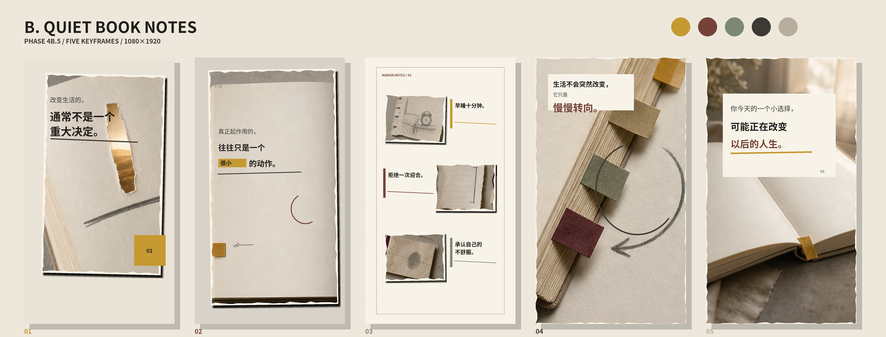

# Direction B — Quiet Book Notes

## Visual identity

Quiet mature book-note language using open pages, graphite marks, underlines, margin rules, restrained tabs and large areas of uncoated paper. Copy behaves like content being read and annotated rather than a subtitle placed over a video.

## Frame decisions

1. A torn window of light interrupts a page and an underline creates the hook.
2. A nearly empty page makes the highlighted phrase `很小` physically small.
3. Three notebook fragments and three margin notes create a clear reading hierarchy.
4. Page-edge tabs and a pencil arrow carry the directional shift.
5. A quiet open spread leaves the final thought suspended in morning light.

## Strengths

- Best caption integration and most natural fit for psychological or growth content.
- Restrained, coherent and easiest to keep readable.
- Strongest automation feasibility because layouts can be built from page, note, underline and tab primitives.

## Weaknesses

- The first three seconds are quieter than A or C.
- Repeated page surfaces may become monotonous without close-up and lighting variation.
- Less suitable for high-energy or strongly visual topics.

## Automation difficulty

Low-medium. A controlled page grid, note roles, line/underline primitives and four layout variants can cover most scenes without large asset libraries.

Source atlas was generated as text-free artwork with the built-in image-generation tool. Chinese copy was rendered later as an independent local-font layer.
