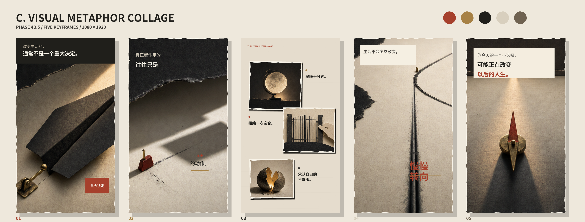

# Direction C — Visual Metaphor Collage

## Visual identity

Adult conceptual collage with one dominant metaphor per frame, large negative space, restrained typography and clear spatial change. Lever, oversized shadow, gate, cracked shell, bending rail and compass communicate the argument without illustrating every sentence literally.

## Frame decisions

1. A small lever begins moving a massive black paper plane.
2. A match-sized switch changes an enormous shadow; the text is split across scale.
3. Moon/clock, closed gate and cracked shell form three separate permissions.
4. A straight rail makes the most obvious visual turn in the set.
5. A compass points toward a distant door of light, leaving emotional after-space.

## Strengths

- Strongest three-second hook and clearest conceptual argument.
- Largest composition and emotional changes across the five frames.
- Most distinct from the Phase 4B central-card template.

## Weaknesses

- Requires a good metaphor inventory and disciplined editorial mapping.
- Sparse copy leaves less room for dense factual passages.
- Weak metaphor selection would quickly become obscure or repetitive.

## Automation difficulty

Medium. Layout primitives are simple, but semantic mapping from approved sentence to approved metaphor asset must be explicit and cannot depend on uncontrolled Provider expansion.

Source atlas was generated as text-free artwork with the built-in image-generation tool. Chinese copy was rendered later as an independent local-font layer.
